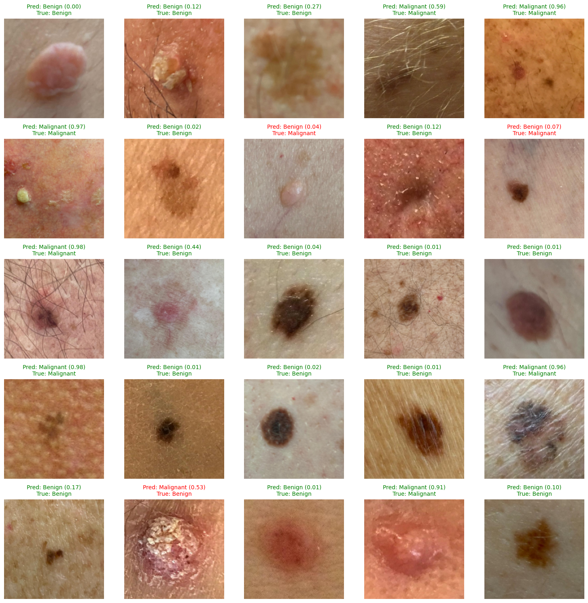

# Melanoma Detection on Smartphone Images

This project investigates melanoma detection on clinical images captured with DSLR and smartphone cameras.

Most existing skin lesion models are trained on **dermoscopic images**, which require specialized clinical equipment, limiting accessibility. **Clinical images**, by contrast, are captured with everyday cameras (DSLRs or smartphones), with more variability in resolution, lighting, and depth. Early detection of skin cancer is critical, so creating models that work on smartphone images could enable more accessible, at-home risk assessment.

We implement a two-stage transfer learning pipeline:  
1. Train a classifier on ISIC DSLR images.  
2. Fine-tune the model on the MIDAS dataset, a collection of iPhone-captured clinical images.  

This approach aims to close the domain gap between high-quality dermoscopic images and real-world smartphone images.

## ISIC (DSLR) Data
The [ISIC Archive](https://www.isic-archive.com/) is a large dataset of dermoscopic and clinical images. We train a model specifically on clinical DSLR images (2,866 images).  

Demo notebooks for the ISIC model:  
- [isic_demo.ipynb](isic_demo.ipynb) – explores model predictions on a small set of 50 randomly selected sample images.  
- [isic_training.ipynb](isic_training.ipynb) – details the training regimen.

## MIDAS (Smartphone Camera) Data
The [MRA-MIDAS dataset](https://stanfordaimi.azurewebsites.net/datasets/f4c2020f-801a-42dd-a477-a1a8357ef2a5) contains paired dermoscopic and smartphone images. We use only clinical smartphone images, manually cropping a subset of 300 images to reduce background noise and interference.  

Demo notebooks for the MIDAS model:  
- [midas_demo.ipynb](midas_demo.ipynb) – shows predictions on a small set of 50 randomly selected sample images.
- [midas_training.ipynb](midas_training.ipynb) – shows the training regimen.

